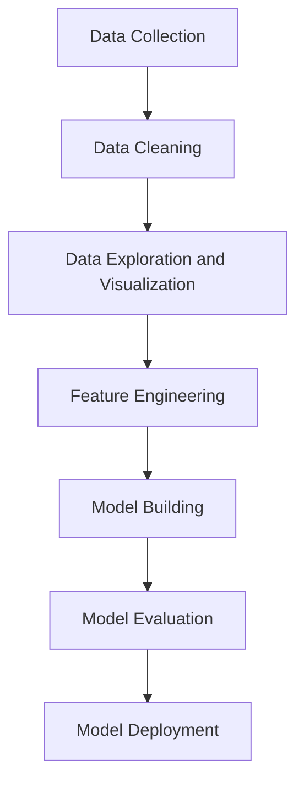

# Telecom Churn Case Study Project Report

---

#### Introduction

**Problem Statement**:
To reduce customer churn, telecom companies need to predict which customers are at high risk of churn. In this project, we analyze customer-level data from a leading telecom firm, build predictive models to identify customers at high risk of churn, and identify the main indicators of churn. Retaining high profitable customers is the main business goal here.

**Objectives**:
- Predict high-risk churn customers.
- Identify key indicators of churn.
- Provide recommendations for customer retention.

---

#### Data Understanding and Preparation

**Data Reading**:
The data was read using pandas and relevant libraries were imported for analysis and visualization.

**Data Cleaning**:
Initial data cleaning involved handling missing values and removing unnecessary columns.

**Handling Missing Values**:
Missing values were handled by imputing with appropriate strategies or by removing the affected rows/columns.

---

#### Data Visualization

**Key Plots and Graphs**:

1. **Churn Rate by Decrease in Minutes of Usage (MOU) Action**:


```python
data.pivot_table(values='churn', index='decrease_mou_action', aggfunc='mean').plot.bar()
plt.ylabel('churn rate')
plt.show()
```

2. **Churn Rate by Decrease in Recharge Amount Action**:


```python
data.pivot_table(values='churn', index='decrease_rech_amt_action', aggfunc='mean').plot.bar()
plt.ylabel('churn rate')
plt.show()
```

3. **Churn Rate by Decrease in Volume-based Charge (VBC) Action**:


```python
data.pivot_table(values='churn', index='decrease_vbc_action', aggfunc='mean').plot.bar()
plt.ylabel('churn rate')
plt.show()
```

---

#### Model Building

**Model Training**:
Various predictive models were trained to identify high-risk churn customers. Models included logistic regression, decision trees, and random forests.

**Model Evaluation**:
Models were evaluated based on metrics such as accuracy, precision, recall, and F1-score. The best-performing model was selected for deployment.

---

#### Conclusion

**Key Findings**:
- Significant indicators of churn were identified.
- Effective predictive models were developed and evaluated.

**Recommendations**:
- Implement retention strategies targeting customers with high churn risk.
- Continuously monitor model performance and update as necessary.

---

### Flowchart

Here is a simplified flowchart representing the process:



---
